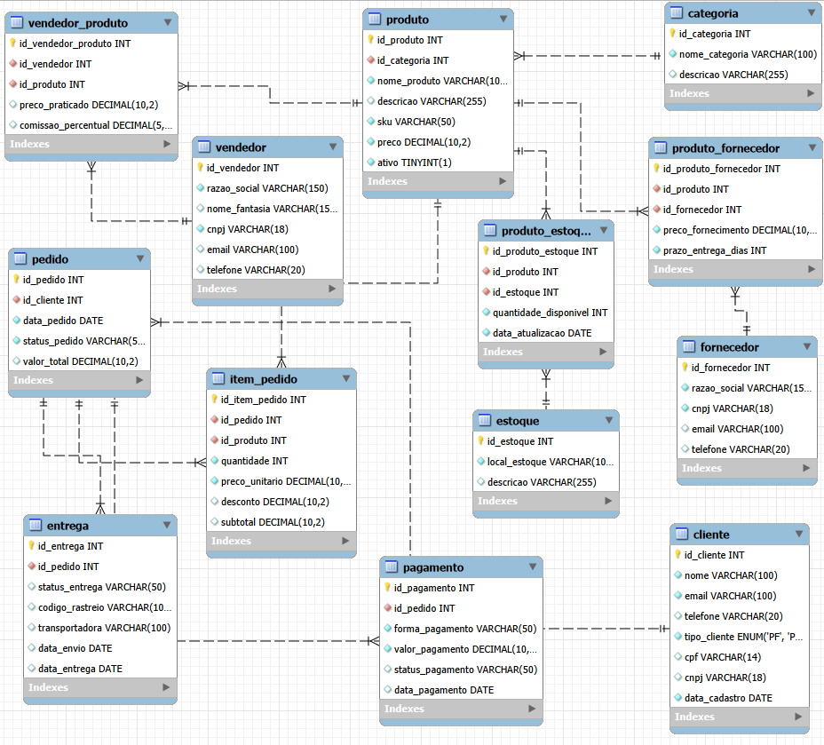
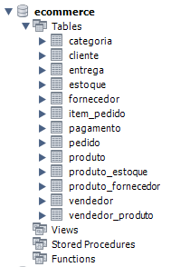

<p align="center">
  
</p>

<p align="center">
  
</p>

<p align="center">
  
</p>

<p align="center">
  Projeto de <b>modelagem e implementação de banco de dados relacional</b> para um sistema de <b>e-commerce</b>, desenvolvido com <b>MySQL</b> como parte de um projeto acadêmico voltado à prática de modelagem, estruturação e consulta de dados.
</p>

<p align="center">
  
  
  
  
  
</p>

---

## `> overview`

Este projeto foi criado para simular a estrutura de um sistema de **e-commerce / marketplace**, aplicando na prática conceitos fundamentais de **banco de dados relacionais**.

O objetivo foi construir um modelo coerente para representar operações comerciais reais, incluindo cadastro de clientes, produtos, vendedores, pedidos, pagamentos, entregas e controle de estoque.

Além da modelagem, o projeto também contempla a criação de scripts SQL para:

- criação do banco
- definição das tabelas
- inserção de dados simulados
- execução de consultas analíticas

---

## `> business_context`

O cenário modelado representa um ambiente de e-commerce com múltiplos vendedores e fluxo completo de operação.

### Entidades contempladas

- clientes
- vendedores parceiros
- produtos
- categorias
- fornecedores
- estoque
- pedidos
- pagamentos
- entregas

Esse contexto permite simular uma lógica próxima à de um **marketplace**, onde vários vendedores podem ofertar produtos dentro da mesma plataforma.

---

## `> learning_objectives`

Este projeto foi desenvolvido com foco em consolidar conhecimentos em:

- modelagem relacional
- normalização
- integridade referencial
- criação de tabelas com chaves primárias e estrangeiras
- relações 1:N e N:N
- consultas SQL para análise de dados
- estruturação de um banco voltado a um cenário de negócio

---

## `> entity_relationship_diagram`

A imagem abaixo apresenta o **modelo relacional completo do banco**, incluindo as entidades e os relacionamentos entre elas.

<p align="center">
  
</p>

### O diagrama representa

- relacionamento entre **clientes e pedidos**
- associação entre **produtos e categorias**
- controle de **estoque por local**
- relação entre **produto e fornecedor**
- relação entre **vendedor e produto**
- fluxo operacional de **pedido → pagamento → entrega**

---

## `> physical_structure`

A imagem abaixo mostra a estrutura física das tabelas após a criação do banco no **MySQL Workbench**.

<p align="center">
  
</p>

### Principais tabelas do sistema

- `categoria`
- `cliente`
- `vendedor`
- `entrega`
- `estoque`
- `fornecedor`
- `item_pedido`
- `pagamento`
- `pedido`
- `produto`
- `produto_estoque`
- `produto_fornecedor`
- `vendedor_produto`

---

## `> project_structure`

```text
Ecommerce-sql-database
│
├── Images/
│   ├── Diagrama_ecommerce.png
│   └── Tabelas_ecommerce.png
│
├── recursos/
│   └── logo/
│       └── Logo-c.png
│
├── Sql/
│   ├── 01_create_database.sql
│   ├── 02_create_tables.sql
│   ├── 03_insert_dados.sql
│   └── 04_queries.sql
│
└── README.md
```

---

## `> how_to_run`

### 1. Criar o banco de dados

```sql
SOURCE Sql/01_create_database.sql;
```

### 2. Criar as tabelas

```sql
SOURCE Sql/02_create_tables.sql;
```

### 3. Inserir os dados simulados

```sql
SOURCE Sql/03_insert_dados.sql;
```

### 4. Executar as consultas

```sql
SOURCE Sql/04_queries.sql;
```

> Você também pode abrir os arquivos individualmente no **MySQL Workbench** e executar por etapa.

---

## `> sql_scripts`

### `01_create_database.sql`
Responsável pela criação do banco de dados `ecommerce`.

### `02_create_tables.sql`
Define toda a estrutura relacional do projeto, incluindo:

- Primary Keys
- Foreign Keys
- constraints
- relacionamentos entre tabelas

### `03_insert_dados.sql`
Insere dados simulados para permitir:

- testes
- validação do modelo
- simulação de operações
- consultas analíticas

### `04_queries.sql`
Contém consultas SQL voltadas à análise operacional e comercial, como:

- produtos mais vendidos
- faturamento por cliente
- controle de estoque
- pedidos e entregas

---

## `> sample_queries`

### Produtos mais vendidos

```sql
SELECT
    pr.nome_produto,
    SUM(ip.quantidade) AS total_vendido
FROM item_pedido ip
INNER JOIN produto pr
    ON ip.id_produto = pr.id_produto
GROUP BY pr.id_produto, pr.nome_produto
ORDER BY total_vendido DESC;
```

### Faturamento total por cliente

```sql
SELECT
    c.nome,
    SUM(p.valor_total) AS faturamento_total
FROM cliente c
INNER JOIN pedido p
    ON c.id_cliente = p.id_cliente
GROUP BY c.id_cliente, c.nome
ORDER BY faturamento_total DESC;
```

### Produtos com estoque baixo

```sql
SELECT
    pr.nome_produto,
    e.local_estoque,
    pe.quantidade_disponivel
FROM produto_estoque pe
INNER JOIN produto pr
    ON pe.id_produto = pr.id_produto
INNER JOIN estoque e
    ON pe.id_estoque = e.id_estoque
WHERE pe.quantidade_disponivel < 15
ORDER BY pe.quantidade_disponivel ASC;
```

---

## `> concepts_applied`

Este projeto aplica conceitos importantes de **banco de dados relacionais**:

- modelagem de dados
- normalização
- integridade referencial
- relacionamentos 1:N
- relacionamentos N:N
- tabelas associativas
- `JOIN`
- `GROUP BY`
- `HAVING`
- `ORDER BY`
- consultas analíticas

---

## `> possible_analysis_scenarios`

Com a estrutura criada, é possível expandir o projeto para análises como:

- produtos mais vendidos
- faturamento por cliente
- controle de estoque por local
- pedidos pendentes e entregues
- análise de relacionamento entre fornecedores e produtos
- visão operacional do fluxo de vendas

---

## `> project_goal`

Este projeto foi desenvolvido com foco em aprendizado prático e consolidação de fundamentos em:

- modelagem de banco de dados
- organização de dados comerciais
- criação de estruturas relacionais
- consultas SQL para análise de operações

Além do contexto acadêmico, ele também demonstra a aplicação de conceitos úteis em cenários reais de sistemas de marketplace e e-commerce.

---

## `> author`

**Christopher Benini**

Profissional focado em **dados, automação e integrações**, com experiência no desenvolvimento de soluções para análise, transformação e estruturação de dados.

<p>
  <a href="https://github.com/chrisbenini">
    
  </a>
</p>
