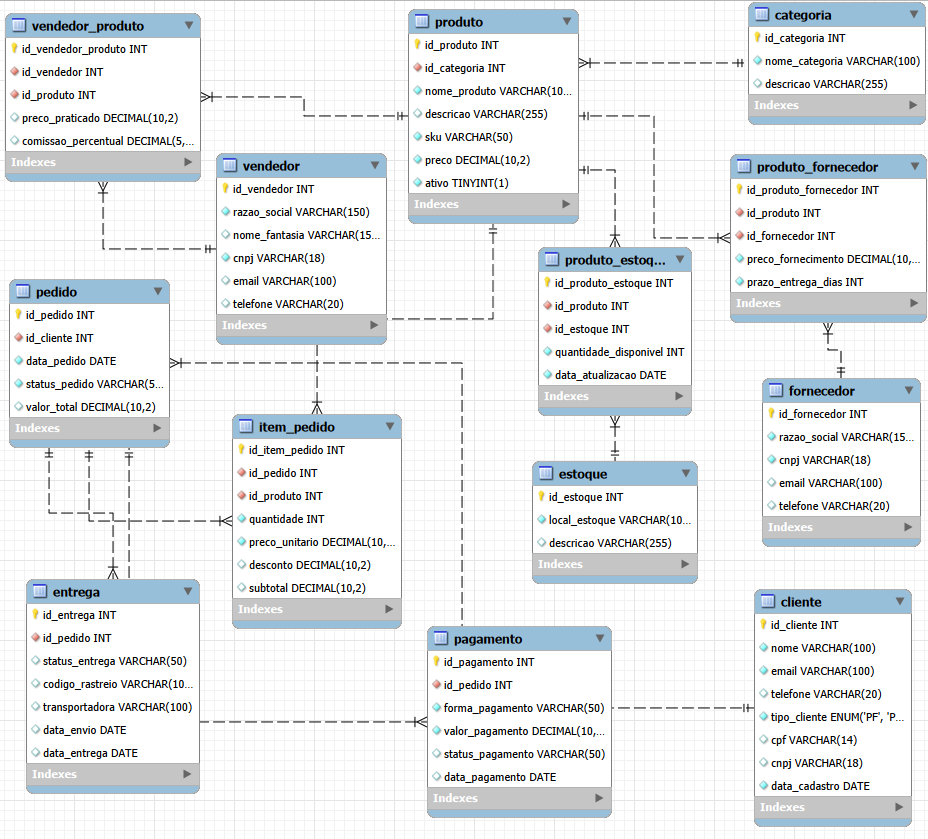

<p align="center">
  
</p>

<h3 align="center">
Relational Database Modeling • MySQL • SQL Analytics
</h3>

---

<p align="center">

</p>

---

## ⚡ Overview

Projeto de **modelagem de banco de dados relacional** simulando um ambiente completo de **E-commerce / Marketplace**.

✔ Modelagem relacional  
✔ Normalização de dados  
✔ Integridade referencial  
✔ Queries analíticas SQL  
✔ Estrutura pronta para cenários reais

---

## 🧱 Database Scope

O banco representa o fluxo operacional completo:

- Clientes  
- Produtos  
- Vendedores  
- Pedidos  
- Pagamentos  
- Entregas  
- Estoque  
- Fornecedores  

Simulação próxima a plataformas reais de marketplace.

---

## 🧰 Tech Stack

<p align="center">

</p>

<p align="center">


</p>

---

## 🗂 Project Structure

```bash
Ecommerce-sql-database
│
├── Images/
├── Sql/
│   ├── create_database.sql
│   ├── create_tables.sql
│   ├── insert_data.sql
│   └── queries.sql
└── README.md
```

---

## ▶ How to Run

```sql
SOURCE Sql/01_create_database.sql;
SOURCE Sql/02_create_tables.sql;
SOURCE Sql/03_insert_dados.sql;
SOURCE Sql/04_queries.sql;
```

---

## 📊 Example Query

```sql
SELECT
    pr.nome_produto,
    SUM(ip.quantidade) AS total_vendido
FROM item_pedido ip
JOIN produto pr ON ip.id_produto = pr.id_produto
GROUP BY pr.nome_produto
ORDER BY total_vendido DESC;
```

---

## 🎯 Concepts Applied

- Relational Modeling  
- Normalization  
- Primary & Foreign Keys  
- 1:N / N:N Relationships  
- JOINs & Aggregations  
- Analytical Queries  

---

## 👨‍💻 Author

<p align="center">

<a href="https://github.com/chrisbenini">

</a>

<a href="https://www.linkedin.com/in/christopher-benini-081b7833a/">

</a>

</p>

---

<p align="center">
⭐ If you liked this project, consider giving a Star.
</p>
